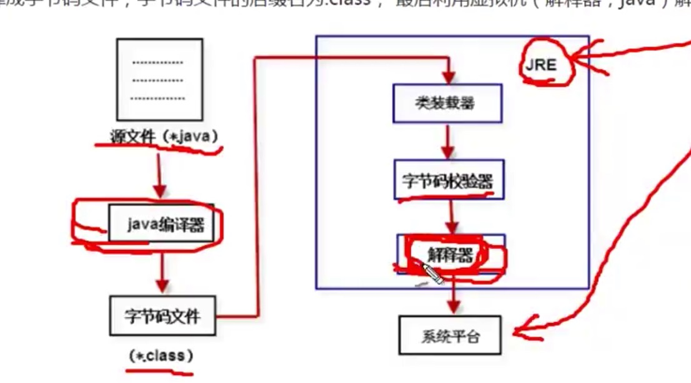
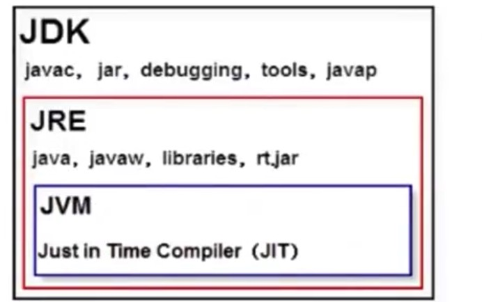

# Java基础

## 	Java的语言特性和优势

1. ## 	跨平台和可移植性:

   1. 这是java的核心优势，Java在设计的时候就很注重移植性和平台性，比如Java的int永远都是32位。不像C++,可能是16，32，可能是根据编译器厂商规定的变化，这样的话程序的移植性就会非常麻烦。

2. 安全性：

   1. Java适合网络/分布式环境，为了达到这个目的，在安全性方面投入了很大的精力，使java可以很容易的构建防病毒，防篡改的系统

3. 面向对象：

   1. 面向对象是一种程序设计技术，非常适合大型软件的设计和开发，由于c++为了照顾大量c语言使用者而兼容了c，是的自身仅仅成为了带类的c语言，多少影响其面向对象的彻底性，Java则是完全的面向对象语言。

4. 简单性:

   1. Java就是c++语法的简化版，我们可以称之为c++-语言，指的就是将c++的一些内容去掉，比如头文件，指针运算，结构，联合，操作重栽，虚基类等等，同时语法基于c语言。

5. 高性能:

   1. Java最初阶段，总是被人诟病低性能，客观上高级语言的运行效率总是低于低级语言，这个是无法避免的。Java语言本身在发展的过程中通过虚拟机的优化提升了几十倍运行效率，将一些热点字节码编译成本地机器码，并将结果缓存起来，在需要的时候重新调用，这样的话，使Java程序的执行效率大大提高了，某一些代码甚至接近C++的效率。
   2. 因此java的低性能的短缺，已经被完全解决了，业界发展上，我们也看到很多c++应用抓到java开发，很多c++程序员转型为java程序员

6. 分布式:

   1. Java是为Internet的分布式环境设计的，因为它能够处理TCP/IP协议。事实上，通过URL访问一个网络资源和访问本地文件一样简单。Java还支持远程方法调用，使程序能够通过网络调用方法。

7. 多线程:

   1. 多线程使用可以带来很多的交互响应操作和实时行为，Java多线程的简单性是Java成为主流服务器端开发语言的主要原因之一。

8. 健壮性：

   1. Java是一种健壮性语言，吸收啦c++/C语言的有点，但去掉了其影响程序健壮性的部分，Java程序不可能造成计算机崩溃，即使Java程序可能有错误，如果出现某种出乎意料之外的事情，程序不会崩溃，而是把异常抛出，通过异常处理机制加以处理。

## Java应用程序的运行机制

1. ​	计算高级语言的类型主要有编译性和解释性两种，而java语言是两种类型的结合。
2. Java首先利用文本编辑器编写java源程序，源文件的后缀名成为.java,再利用编译器(javac)将源程序编译成字节码文件，字节码文件的后缀名为.class，最后利用虚拟机解释执行。

## JVM，JRE和JDK的区别

1. ​	jvm就是一个虚拟的用于执行bytecode字节码的虚拟计算机，他也定义了指令集，寄存器集，结构栈，垃圾收集栈，内存区域，JVM负责将java字节码解释运行，边解释，边运行，速度就会受到一定的影响。
2. 不同的操作系统有不同的虚拟机，Java虚拟机机制屏蔽啦底层运行平台的差别，实现了一次编译，到处运行，Java虚拟机是实现跨平台的核心机制，
3. 
4. JRE:包含java虚拟机，库函数，运行java应用程序所必需的文件
5. JDK:包含JRE，以及增加编译器和调试器等用于程序开发的文件
6. 

## JDK下载和环境变量配置

- 参考如下网址:

  [JDK下载和配置](https://blog.csdn.net/huaicainiao/article/details/79340572)

  14未看